# Build client-side web parts connected to Microsoft Graph

> **Note:** The SharePoint Framework is currently in preview and is subject to change. SharePoint Framework client-side web parts are not currently supported for use in production environments.

In this tutorial you will build a SharePoint Framework client-side web part that shows upcoming meetings for today using the Microsoft Graph.

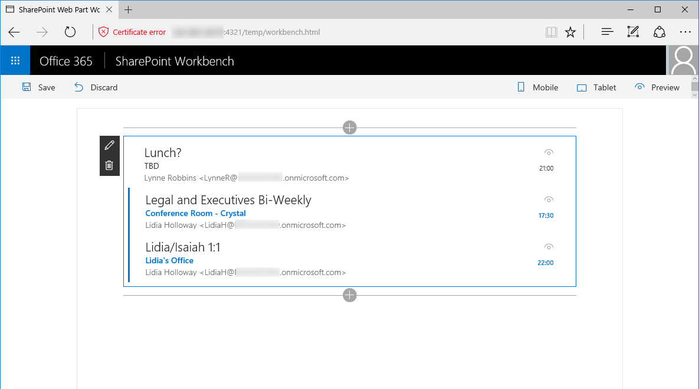

While this tutorial focuses on connecting a SharePoint Framework client-side web part to the Microsoft Graph, you can use the same approach to connect your web part to any other resource secured with Azure Active Directory (AAD).

The source of the working web part is available on GitHub at [https://github.com/SharePoint/sp-dev-fx-webparts/tree/master/samples/react-aad-implicitflow](https://github.com/SharePoint/sp-dev-fx-webparts/tree/master/samples/react-aad-implicitflow).

> **Note:** Before following the steps in this article, be sure to [set up your development environment](http://dev.office.com/sharepoint/docs/spfx/set-up-your-development-environment) for building SharePoint Framework solutions.

## Create new project

Start by creating a new folder for your project:

```sh
md react-msgraph-upcomingmeetings
```

Navigate to the project folder:

```sh
cd react-msgraph-upcomingmeetings
```

In the project folder execute the SharePoint Framework Yeoman generator to scaffold a new SharePoint Framework project:

```sh
yo @microsoft/sharepoint
```

When prompted, use the following values:
- **react-msgraph-upcomingmeetings** as your solution name
- **Use the current folder** for the location to place the files
- **Upcoming meetings** as your web part name
- **Shows upcoming meetings for today** as your web part description
- **React** as the starting point to build the web part

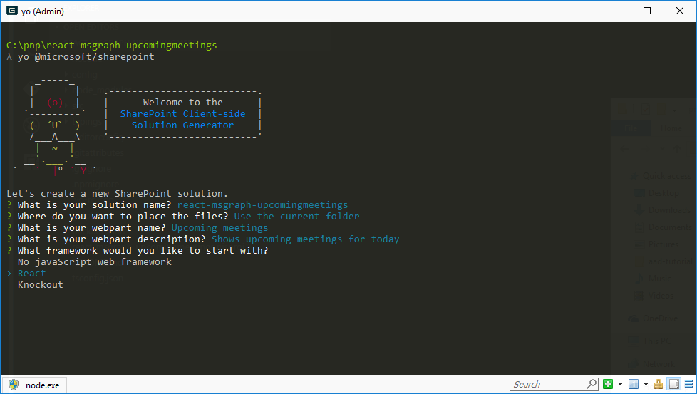

Once the scaffolding completes, open your project folder in your code editor. In this tutorial, you will use Visual Studio Code.

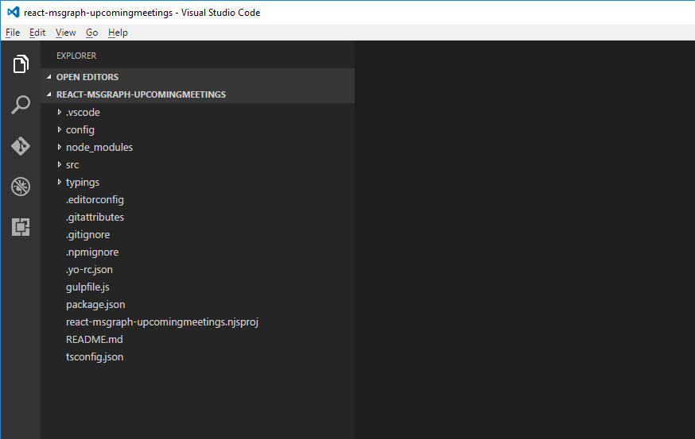

## Add ADAL JS

To communicate with AAD-secured resources your SharePoint Framework client-side web part must implement OAuth. An easy way to do this, is by using the [ADAL JS library](https://github.com/AzureAD/azure-activedirectory-library-for-js) published by Microsoft.

### Install ADAL JS in your project

Install ADAL JS in your project by executing in the command line:

```sh
npm install adal-angular --save
```

Despite its name, the `adal-angular` package contains a framework-independent OAuth implementation that you can use with any JavaScript framework.

### Install ADAL JS TypeScript typings

Because you will be working with ADAL JS in TypeScript you need to install its TypeScript typings. To do that in the command line execute:

```sh
tsd install adal-angular --save
```

## Configure ADAL JS for use with SharePoint Framework web parts

ADAL JS has been designed to work with client-side applications that own the whole page. In order to use it with SharePoint Framework client-side web parts, it needs to be patched.

### Patch the default ADAL JS implementation

In the **./src/webparts** folder in your project create a new file called **WebPartAuthenticationContext.js** and inside paste the following contents:

```js
const AuthenticationContext = require('adal-angular');

AuthenticationContext.prototype._getItemSuper = AuthenticationContext.prototype._getItem;
AuthenticationContext.prototype._saveItemSuper = AuthenticationContext.prototype._saveItem;
AuthenticationContext.prototype.handleWindowCallbackSuper = AuthenticationContext.prototype.handleWindowCallback;
AuthenticationContext.prototype._renewTokenSuper = AuthenticationContext.prototype._renewToken;
AuthenticationContext.prototype.getRequestInfoSuper = AuthenticationContext.prototype.getRequestInfo;

AuthenticationContext.prototype._getItem = function (key) {
  if (this.config.webPartId) {
    key = this.config.webPartId + '_' + key;
  }

  return this._getItemSuper(key);
};

AuthenticationContext.prototype._saveItem = function (key, object) {
  if (this.config.webPartId) {
    key = this.config.webPartId + '_' + key;
  }

  return this._saveItemSuper(key, object);
};

AuthenticationContext.prototype.handleWindowCallback = function (hash) {
  if (hash == null) {
    hash = window.location.hash;
  }

  if (!this.isCallback(hash)) {
    return;
  }

  var requestInfo = this.getRequestInfo(hash);
  if (requestInfo.requestType === this.REQUEST_TYPE.LOGIN) {
    return this.handleWindowCallbackSuper(hash);
  }

  var resource = this._getResourceFromState(requestInfo.stateResponse);
  if (!resource || resource.length === 0) {
    return;
  }

  if (this._getItem(this.CONSTANTS.STORAGE.RENEW_STATUS + resource) === this.CONSTANTS.TOKEN_RENEW_STATUS_IN_PROGRESS) {
    return this.handleWindowCallbackSuper(hash);
  }
}

AuthenticationContext.prototype._renewToken = function (resource, callback) {
  this._renewTokenSuper(resource, callback);
  var _renewStates = this._getItem('renewStates');
  if (_renewStates) {
    _renewStates = _renewStates.split(';');
  }
  else {
    _renewStates = [];
  }
  _renewStates.push(this.config.state);
  this._saveItem('renewStates', _renewStates);
}

AuthenticationContext.prototype.getRequestInfo = function (hash) {
  var requestInfo = this.getRequestInfoSuper(hash);
  var _renewStates = this._getItem('renewStates');
  if (!_renewStates) {
    return requestInfo;
  }

  _renewStates = _renewStates.split(';');
  for (var i = 0; i < _renewStates.length; i++) {
    if (_renewStates[i] === requestInfo.stateResponse) {
      requestInfo.requestType = this.REQUEST_TYPE.RENEW_TOKEN;
      requestInfo.stateMatch = true;
      break;
    }
  }

  return requestInfo;
}

window.AuthenticationContext = function() {
  return undefined;
}
```

> The detailed description of the different pieces of this patch are available at [https://github.com/waldekmastykarz/sp-dev-docs/blob/aad-implicitflow/docs/spfx/web-parts/developer-guide/connect-client-side-web-parts-to-aad-secured-resources.md](https://github.com/waldekmastykarz/sp-dev-docs/blob/aad-implicitflow/docs/spfx/web-parts/developer-guide/connect-client-side-web-parts-to-aad-secured-resources.md).

In the same folder create a new file called **IAdalConfig.ts** and inside paste the following contents:

```ts
export interface IAdalConfig extends adal.Config {
  popUp?: boolean;
  callback?: (error: any, token: string) => void;
  webPartId?: string;
}
```

### Add ADAL JS to the Upcoming meetings web part

In the **./src/webparts/upcomingMeetings** folder create a new file called **AdalConfig.ts** and inside paste the following contents:

```ts
const adalConfig: adal.Config = {
  clientId: '00000000-0000-0000-0000-000000000000',
  tenant: 'common',
  extraQueryParameter: 'nux=1',
  endpoints: {
    'https://graph.microsoft.com': 'https://graph.microsoft.com'
  },
  postLogoutRedirectUri: window.location.origin,
  cacheLocation: 'sessionStorage'
};

export default adalConfig;
```

Later on, after you registered a new application in Azure AD, you will update the empty GUID in the **clientId** property, with the AAD application ID. 

In the **./src/webparts/upcomingMeetings/components/UpcomingMeetings.tsx** file, after the `import { IUpcomingMeetingsWebPartProps } from '../IUpcomingMeetingsWebPartProps';` line, add the following statements:

```ts
const AuthenticationContext = require('adal-angular');
import adalConfig from '../AdalConfig';
import { IAdalConfig } from '../../IAdalConfig';
import '../../WebPartAuthenticationContext';
```

## Add AAD authentication

Before your web part can access the Microsoft Graph it must get an access token for the current user. To do that, the web part must allow user to sign in with AAD.

### Extend the component properties

In the **./src/webparts/upcomingMeetings/components/UpcomingMeetings.tsx** file extend the **IUpcomingMeetingsProps** interface with a new property called **webPartId**:

```ts
export interface IUpcomingMeetingsProps extends IUpcomingMeetingsWebPartProps {
  webPartId: string;
}
```

### Add support for state tracking

In the same file define new interface called **IUpcomingMeetingsState**:

```ts
export interface IUpcomingMeetingsState {
  error: string;
  signedIn: boolean;
}
```

Extend the **UpcomingMeetings** component class declaration with the newly created state interface:

```ts
export default class UpcomingMeetings extends React.Component<IUpcomingMeetingsProps, IUpcomingMeetingsState> {
  // ...
}
```

### Initiate component state and ADAL JS authentication context

In the **UpcomingMeetings** class add a new class variable called **authCtx**:

```ts
export default class UpcomingMeetings extends React.Component<IUpcomingMeetingsProps, IUpcomingMeetingsState> {
  private authCtx: adal.AuthenticationContext;

  // ...
}
```

Because you changed the signature of the component, you also have to update how that component is instantiated in the web part. In the **./src/webparts/upcomingMeetings/UpcomingMeetingsWebPart.ts** file, in the **render** function, update the component creation statement to:

```ts
public render(): void {
  const element: React.ReactElement<IUpcomingMeetingsProps> = React.createElement(UpcomingMeetings, {
    description: this.properties.description,
    webPartId: this.context.instanceId
  });

  ReactDom.render(element, this.domElement);
}
```

Because you added state to your React component, you also have to set its initial value. Without this, rendering your component would fail.

In the **./src/webparts/upcomingMeetings/components/UpcomingMeetings.tsx** file, to the **UpcomingMeetings** class add the constructor:

```ts
export default class UpcomingMeetings extends React.Component<IUpcomingMeetingsProps, IUpcomingMeetingsState> {
  private authCtx: adal.AuthenticationContext;

  constructor(props: IUpcomingMeetingsProps, state: IUpcomingMeetingsState) {
    super(props);

    this.state = {
      error: null,
      signedIn: false
    };

    const config: IAdalConfig = adalConfig;
    config.popUp = true;
    config.webPartId = this.props.webPartId;
    config.callback = (error: any, token: string): void => {
      this.setState((previousState: IUpcomingMeetingsState, currentProps: IUpcomingMeetingsProps): IUpcomingMeetingsState => {
        previousState.error = error;
        previousState.signedIn = !(!this.authCtx.getCachedUser());
        return previousState;
      });
    };

    this.authCtx = new AuthenticationContext(config);
    AuthenticationContext.prototype._singletonInstance = undefined;
  }

  // ...
}
```

### Handle OAuth callbacks

OAuth implicit flow is based on callbacks which must be processed by the web part for the authentication to complete. To add support for processing OAuth callbacks in the component class add the **componentDidMount** function:

```ts
public componentDidMount(): void {
  this.authCtx.handleWindowCallback();

  if (window !== window.top) {
    return;
  }

  this.setState((previousState: IUpcomingMeetingsState, props: IUpcomingMeetingsProps): IUpcomingMeetingsState => {
    previousState.error = this.authCtx.getLoginError();
    previousState.signedIn = !(!this.authCtx.getCachedUser());
    return previousState;
  });
}
```

After user logged in, you will load upcoming meetings from the Microsoft Graph. You will implement it later, but for now you will display a message to verify that the user is signed in. In the component class add the **componentDidUpdate** function:

```ts
public componentDidUpdate(prevProps: IUpcomingMeetingsProps, prevState: IUpcomingMeetingsState, prevContext: any): void {
  if (prevState.signedIn !== this.state.signedIn) {
    console.log('Signed in');
  }
}
```

### Add user interface to start authentication

To allow users to sign in to Azure AD, your web part will display a button which will trigger the authentication flow.

Import the Office UI Fabric React Button component by changing the Office UI Fabric React **import** statement in your component to:

```ts
import {
  Button, ButtonType
} from 'office-ui-fabric-react';
```

Change the **render** function to:

```tsx
public render(): JSX.Element {
  const login: JSX.Element = this.state.signedIn ? <div /> : <Button onClick={() => { this.signIn(); } } buttonType={ButtonType.compound} description="Sign in to see your upcoming meetings">Sign in</Button>;
  const error: JSX.Element = this.state.error ? <div><strong>Error: </strong> {this.state.error}</div> : <div/>;

  return (
    <div className={styles.upcomingMeetings}>
      {login}
      {error}
    </div>
  );
}
```

Add the missing sign in button click event handler where you start the OAuth authentication flow:

```ts
public signIn(): void {
  this.authCtx.login();
}
```

## Register new application in Azure Active Directory

Before you can verify that users can sign in with their Azure AD account in your web part, you have to register a new AAD application and associate it with your web part.

### Create new AAD application

Go to the Azure Portal at [https://portal.azure.com](https://portal.azure.com). From the menu choose the **Azure Active Directory** option.

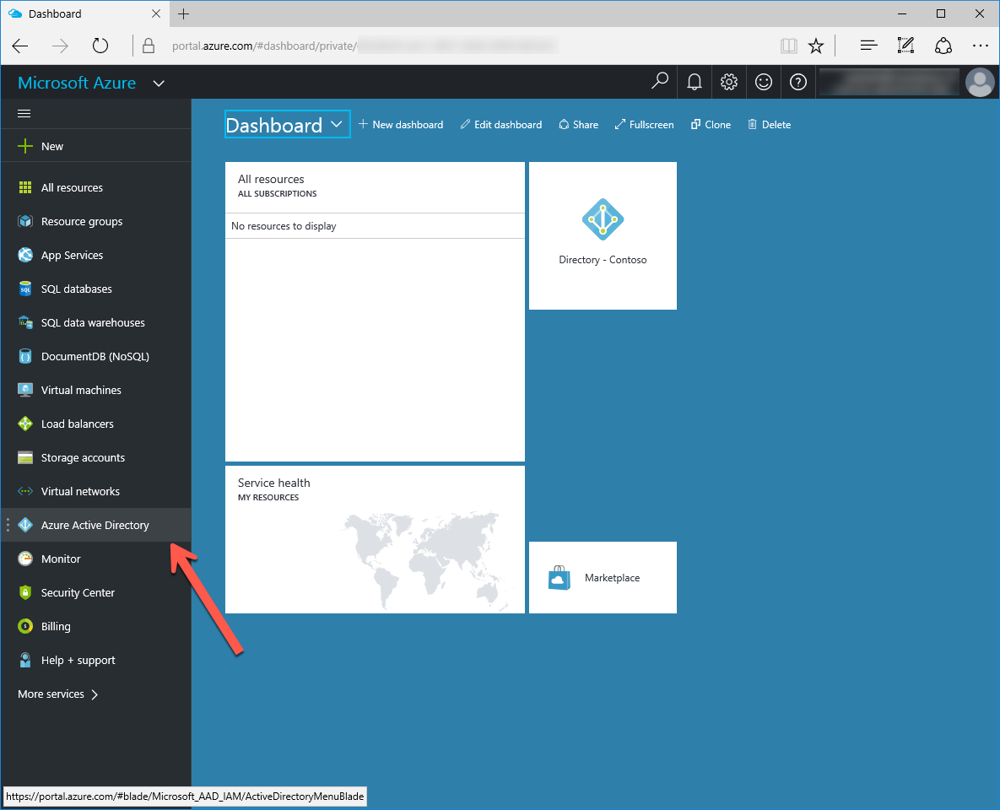

On the **Azure Active Directory** blade, choose the **App registrations** tile.

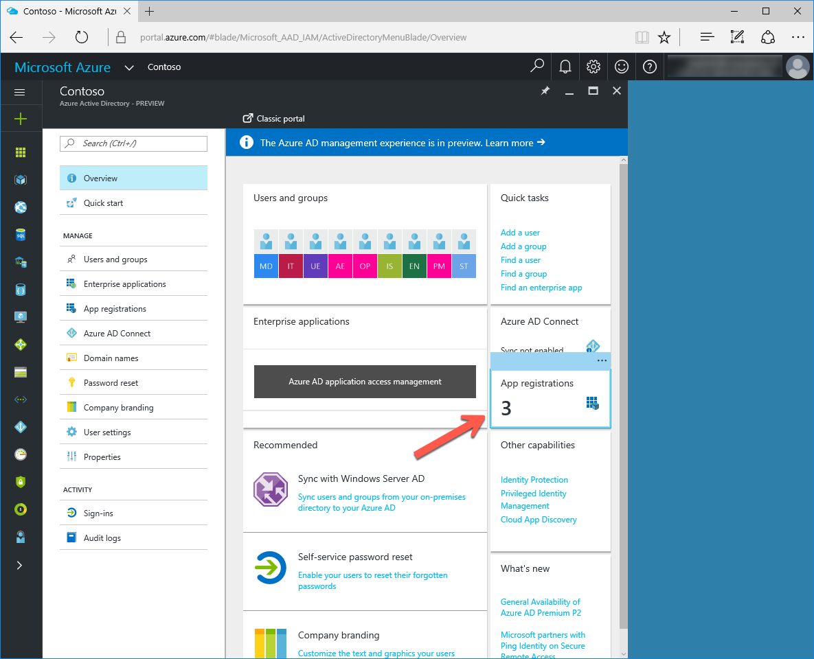  

On the **App registrations** blade from the top menu choose the **Add** option to register a new AAD application.

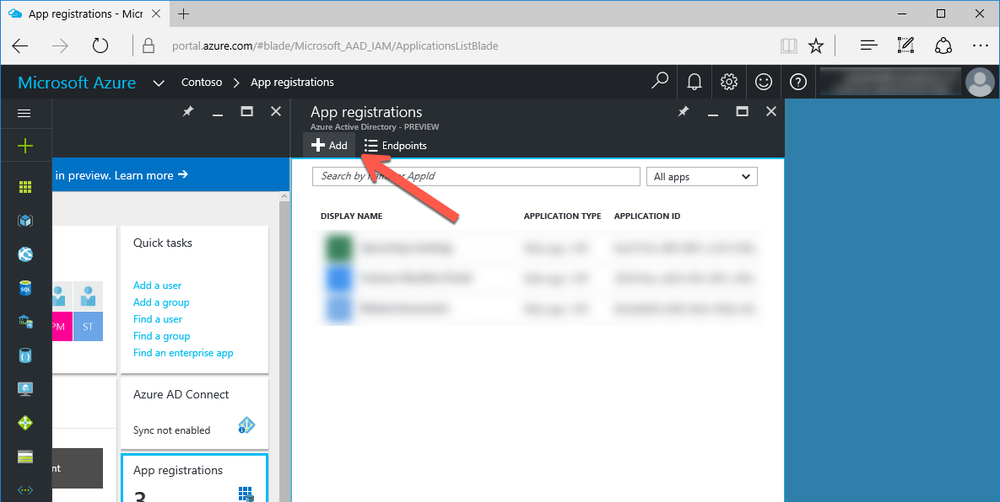

On the **Create** blade, use the following values:
- **Upcoming meetings** as name
- **Web app/API** as application type
- **https://yourmachine:4321/temp/workbench.html** as sign-on URL. Replace `yourmachine` with the name of your development machine

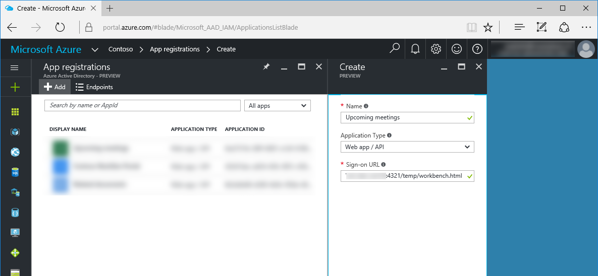

Create the new app by clicking the **Create** button.

### Enable OAuth implicit flow

Once the application is created, select it in the list of registered application to open its information.

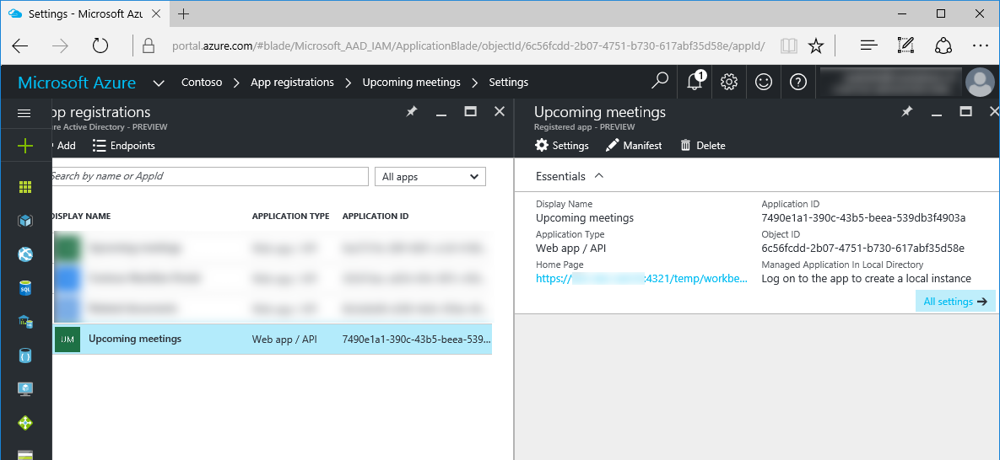

From the top menu click the **Manifest** button to edit the application's manifest. Change the value of the **oauth2AllowImplicitFlow** property to `true` and click the **Save** button to confirm the changes.

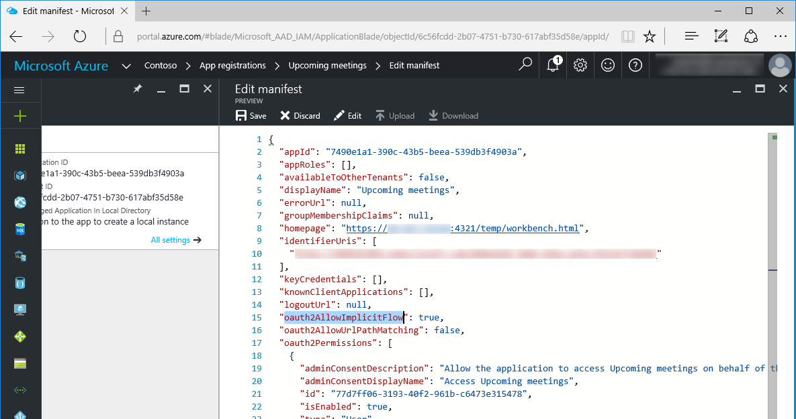

### Register AAD application with web part 

Go back to the app information blade and copy the application ID.

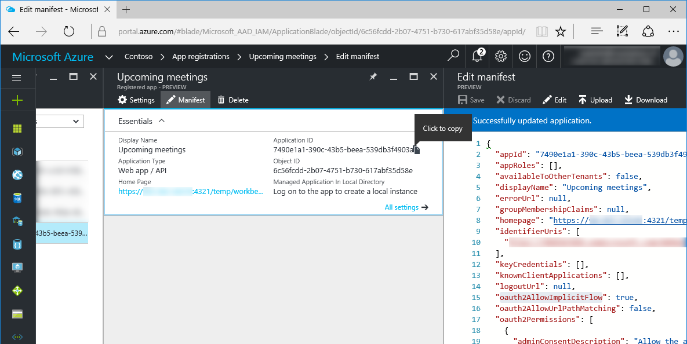

In your code editor, open the **./src/webparts/upcomingMeetings/AdalConfig.ts** file and paste the copied application ID as the value of the **clientId** property.

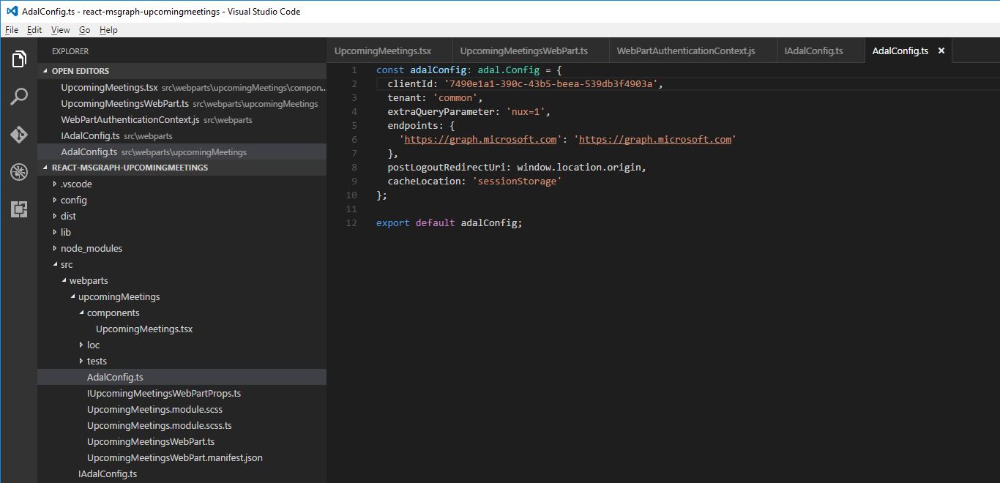

### Test web part

At this point you can verify that users can sign in using their AAD account in your web part.

In the command line execute:

```sh
gulp serve
```

In the SharePoint workbench add the Upcoming meetings web part to the page.

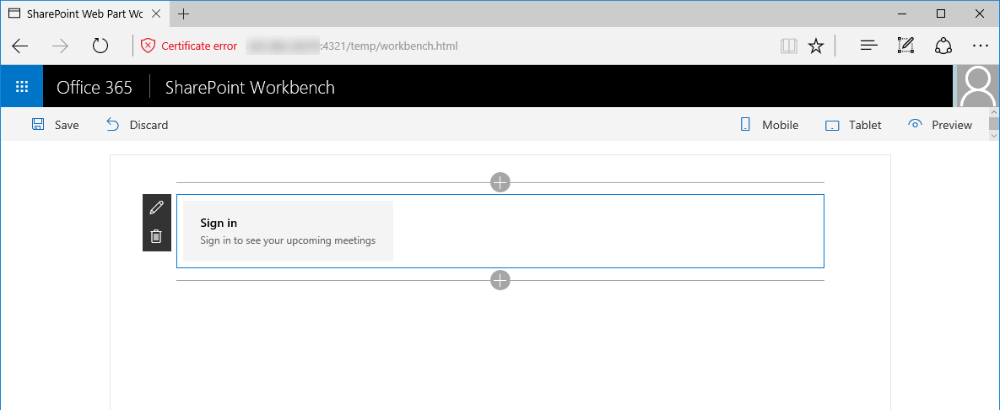

When you click the **Sign in** button, the AAD login window will pop-up.

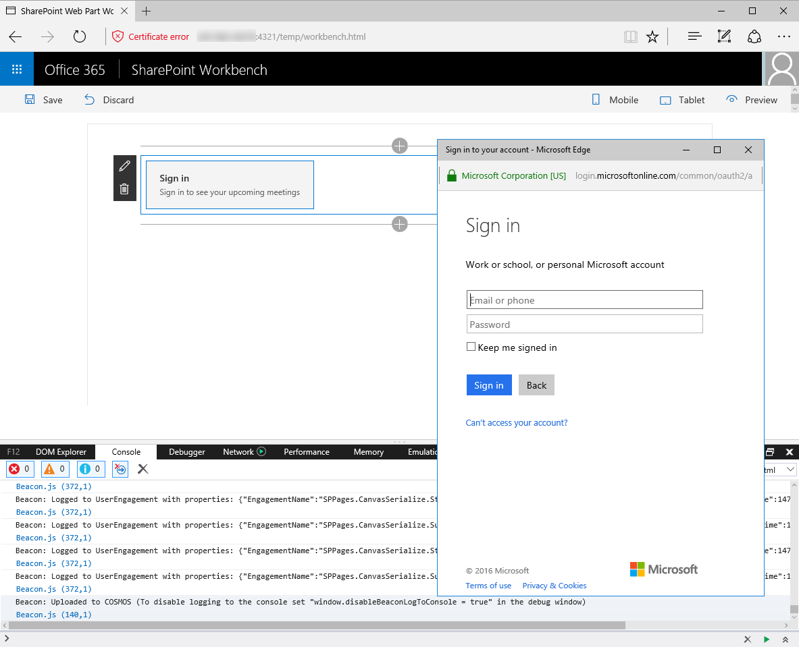

As this is the first time this application is being used, you have to consent its access.

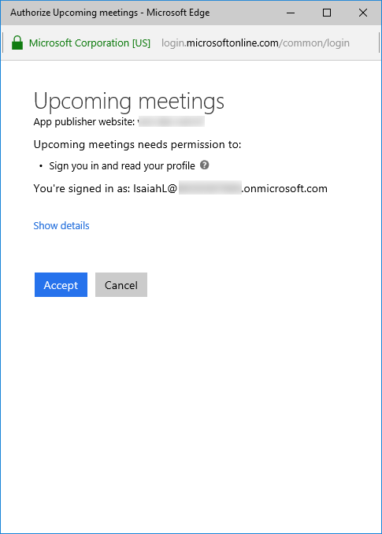

After clicking the **Accept** button, you will get signed in and see the confirmation in the console.

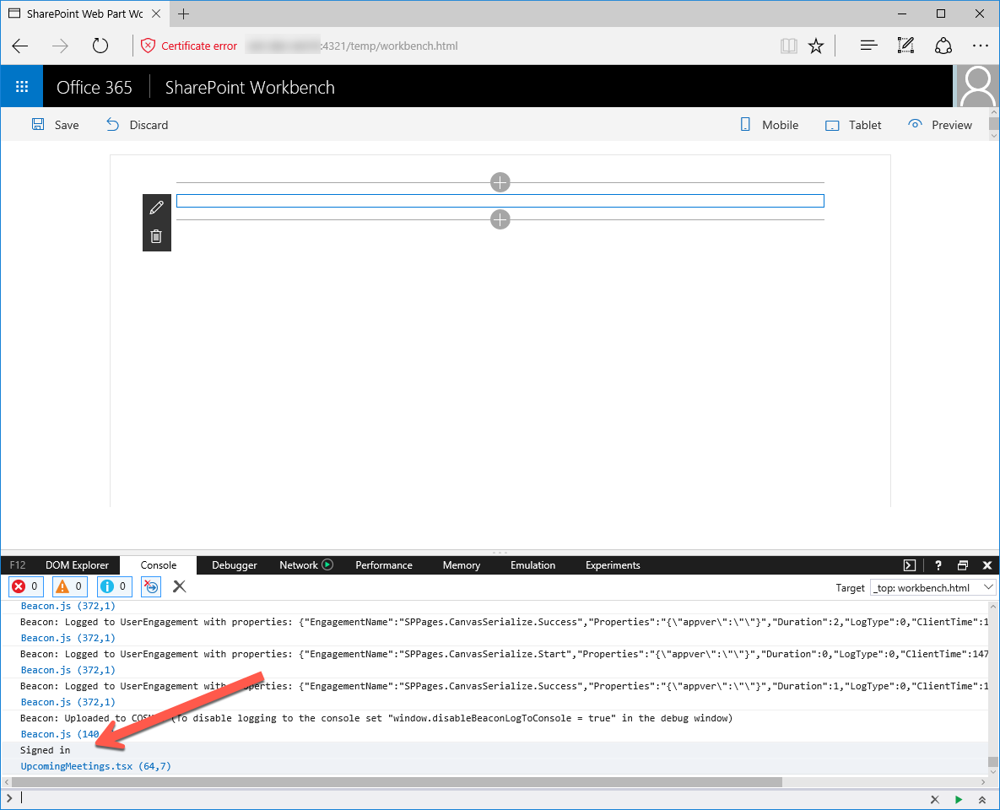

## Load upcoming events

Now that the web part is connected to Azure AD and allows you to sign in with your AAD account, you can extend it to load upcoming events.

### Grant web part's AAD application permission to calendar

When you registered the AAD application for use by the web part, you used the default set of permissions, which gives the web part only access to user's basic profile information. For the web part to be able to get the list of upcoming meetings, it has to have the permission to read user's calendar.

Go to the Azure Management Portal at [https://manage.windowsazure.com](https://manage.windowsazure.com). From the menu choose **Active Directory**.

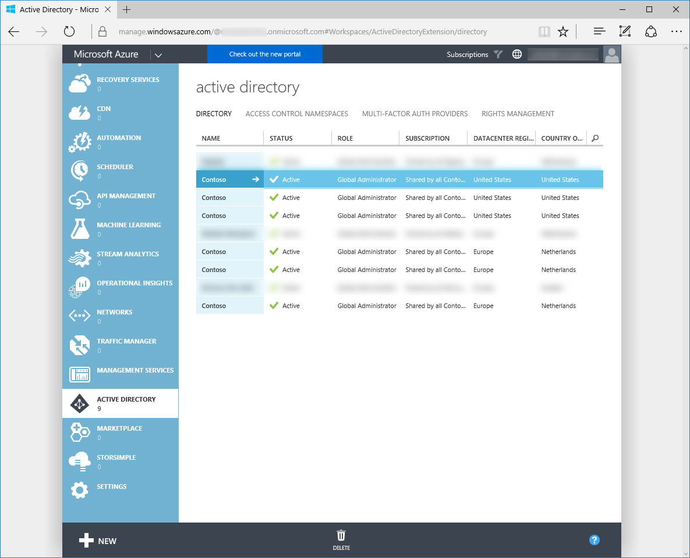

From the list of directories, open your directory and from the top menu open the **Applications** page. Adjust the filter to **Applications my company owns** and from the list select your application.


On the application details page scroll down to the **permissions to other applications** section and click the **Add application** button.

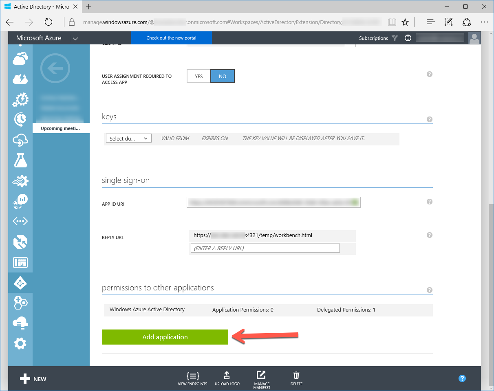

In the **Permissions to other applications** pop up, select **Microsoft Graph** and confirm your choice by clicking the checkmark button.

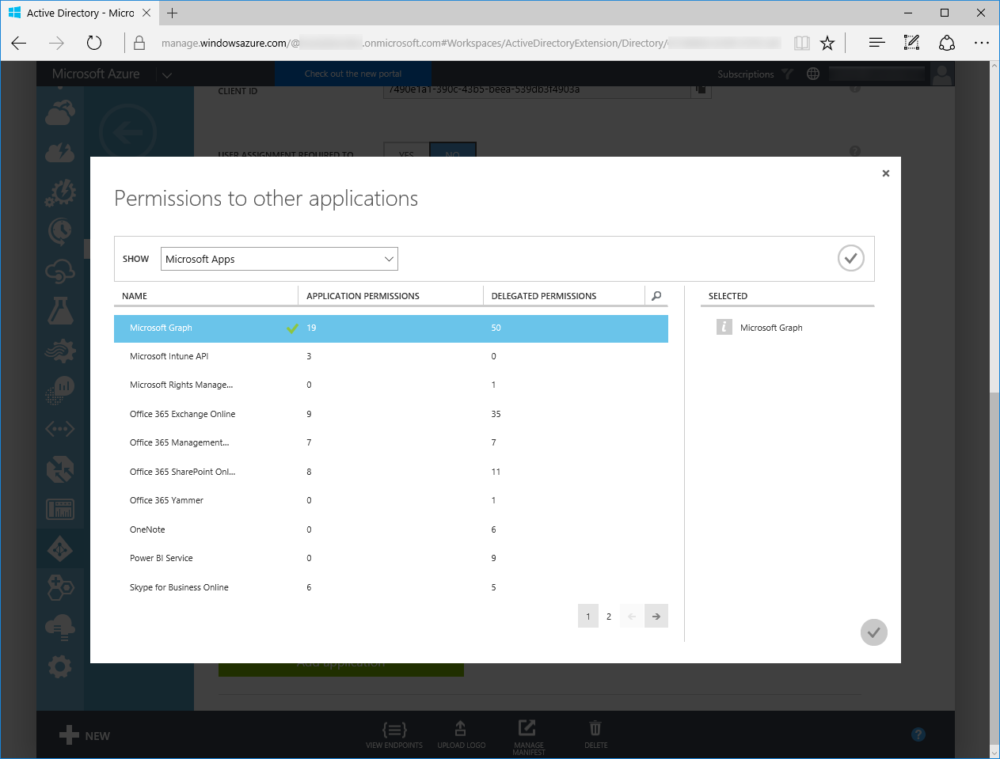

In the list of delegated permissions select the **Read user calendars** permission and confirm your choice by clicking the **Save** button.

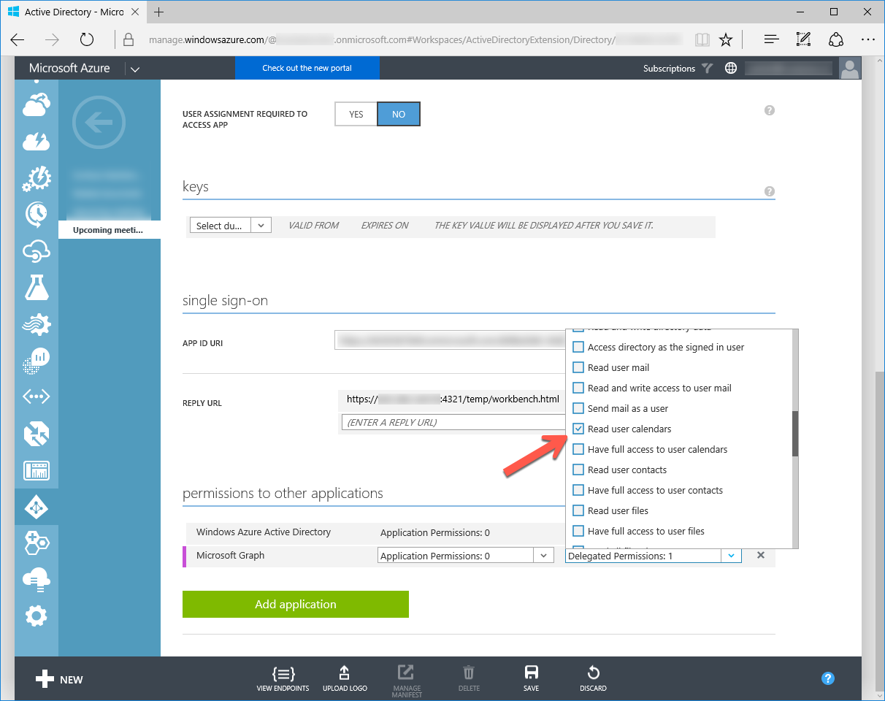

### Pass HttpClient to React component

To retrieve the list of upcoming meetings, you will use the Microsoft Graph REST API. To execute the web request you can use the HTTP client available in the web part. Before you do however, you need to make it available in the React component where the call will be done.

In the code editor open the **./src/webparts/upcomingMeetings/components/UpcomingMeetings.tsx** file. To the list of **import** statements add:

```ts
import { HttpClient } from '@microsoft/sp-client-base';
```

Next, extend the the **IUpcomingMeetingsProps** interface with a new property called **httpClient**.

```ts
export interface IUpcomingMeetingsProps extends IUpcomingMeetingsWebPartProps {
  webPartId: string;
  httpClient: HttpClient;
}
```

In the **./src/webparts/upcomingMeetings/UpcomingMeetingsWebPart.ts** file, in the **render** function, change how the component is created and pass the instance of HttpClient from the web part.

```ts
public render(): void {
  const element: React.ReactElement<IUpcomingMeetingsProps> = React.createElement(UpcomingMeetings, {
    description: this.properties.description,
    webPartId: this.context.instanceId,
    httpClient: this.context.httpClient
  });

  ReactDom.render(element, this.domElement);
}
```

In the **./src/webparts/upcomingMeetings/components** folder create a new file called **IMeeting.ts** and inside paste the following contents:

```ts
export interface IMeeting {
  id: string;
  subject: string;
  start: Date;
  end: Date;
  webLink: string;
  isAllDay: boolean;
  location: string;
  organizer: string;
  status: string;
}
```

You will use this interface to model a meeting item in your web part.

Back in the **./src/webparts/upcomingMeetings/components/UpcomingMeetings.tsx** file import the **IMeeting** interface by adding to the list of **import** statements:

```ts
import { IMeeting } from './IMeeting';
```

Next, extend the **IUpcomingMeetingsState** interface with two properties:

```ts
export interface IUpcomingMeetingsState {
  error: string;
  signedIn: boolean;
  upcomingMeetings: IMeeting[];
  loading: boolean;
}
```

In the constructor change how the initial state is set including the newly added properties:

```ts
constructor(props: IUpcomingMeetingsProps, state: IUpcomingMeetingsState) {
  super(props);

  this.state = {
    error: null,
    signedIn: false,
    upcomingMeetings: [],
    loading: false
  };

  // ...
}
```

Next, add the **loadUpcomingMeetings** function responsible for loading upcoming meetings and communicating its progress to the user.

```ts
private loadUpcomingMeetings(): void {
  this.setState((previousState: IUpcomingMeetingsState, props: IUpcomingMeetingsProps): IUpcomingMeetingsState => {
    previousState.loading = true;
    return previousState;
  });

  this.getGraphAccessToken()
    .then((accessToken: string): Promise<IMeeting[]> => {
      return UpcomingMeetings.getUpcomingMeetings(accessToken, this.props.httpClient);
    })
    .then((upcomingMeetings: IMeeting[]): void => {
      this.setState((prevState: IUpcomingMeetingsState, props: IUpcomingMeetingsProps): IUpcomingMeetingsState => {
        prevState.loading = false;
        prevState.upcomingMeetings = upcomingMeetings;
        return prevState;
      });
    }, (error: any): void => {
      this.setState((prevState: IUpcomingMeetingsState, props: IUpcomingMeetingsProps): IUpcomingMeetingsState => {
        prevState.loading = false;
        prevState.error = error;
        return prevState;
      });
    });
}
```

After updating the state, to communicate to the user, that the web part is loading upcoming meeting, the component retrieves an access token for Microsoft Graph using the **getGraphAccessToken** function:

```ts
private getGraphAccessToken(): Promise<string> {
  return new Promise<string>((resolve: (accessToken: string) => void, reject: (error: any) => void): void => {
    const graphResource: string = 'https://graph.microsoft.com';
    const accessToken: string = this.authCtx.getCachedToken(graphResource);
    if (accessToken) {
      resolve(accessToken);
      return;
    }

    if (this.authCtx.loginInProgress()) {
      reject('Login already in progress');
      return;
    }

    this.authCtx.acquireToken(graphResource, (error: string, token: string) => {
      if (error) {
        reject(error);
        return;
      }

      if (token) {
        resolve(token);
      }
      else {
        reject('Couldn\'t retrieve access token');
      }
    });
  });
}
```

Once the component has a valid access token, it uses it to retrieve upcoming meetings from the Microsoft Graph using the **getUpcomingMeetings** function.

```ts
private static getUpcomingMeetings(accessToken: string, httpClient: HttpClient): Promise<IMeeting[]> {
  return new Promise<IMeeting[]>((resolve: (upcomingMeetings: IMeeting[]) => void, reject: (error: any) => void): void => {
    const now: Date = new Date();
    const dateString: string = now.getUTCFullYear() + '-' + UpcomingMeetings.getPaddedNumber(now.getUTCMonth() + 1) + '-' + UpcomingMeetings.getPaddedNumber(now.getUTCDate());
    const startDate: string = dateString + 'T' + UpcomingMeetings.getPaddedNumber(now.getUTCHours()) + ':' + UpcomingMeetings.getPaddedNumber(now.getUTCMinutes()) + ':' + UpcomingMeetings.getPaddedNumber(now.getUTCSeconds()) + 'Z';
    const endDate: string = dateString + 'T23:59:59Z';

    httpClient.get(`https://graph.microsoft.com/v1.0/me/calendarView?startDateTime=${startDate}&endDateTime=${endDate}&$orderby1=Start&$select=id,subject,start,end,webLink,isAllDay,location,organizer,showAs`, {
      headers: {
        'Accept': 'application/json;odata.metadata=none',
        'Authorization': 'Bearer ' + accessToken
      }
    })
      .then((response: Response): Promise<{ value: ICalendarMeeting[] }> => {
        return response.json();
      })
      .then((todayMeetings: { value: ICalendarMeeting[] }): void => {
        const upcomingMeetings: IMeeting[] = [];

        for (let i: number = 0; i < todayMeetings.value.length; i++) {
          const meeting: ICalendarMeeting = todayMeetings.value[i];
          const meetingStartDate: Date = new Date(meeting.start.dateTime + 'Z');
          if (meetingStartDate.getDate() === now.getDate()) {
            upcomingMeetings.push(UpcomingMeetings.getMeeting(meeting));
          }
        }
        resolve(upcomingMeetings);
      }, (error: any): void => {
        reject(error);
      });
  });
}

private static getPaddedNumber(n: number): string {
  if (n < 10) {
    return '0' + n;
  }
  else {
    return n.toString();
  }
}
```

The meetings returned by the Microsoft Graph are in a different format than defined in the **IMeeting** interface. To convert the meeting from the raw format retrieved from the Microsoft Graph to the **IMeeting** interface the **getUpcomingMeetings** function uses the **getMeeting** function.

In the **./src/webparts/upcomingMeetings/components/UpcomingMeetings.tsx** file, outside of the **UpcomingMeetings** class add the **ICalendarMeeting** interface.

```ts
interface ICalendarMeeting {
  id: string;
  subject: string;
  webLink: string;
  isAllDay: boolean;
  start: {
    dateTime: string;
  };
  end: {
    dateTime: string;
  };
  location: {
    displayName: string;
  };
  organizer: {
    emailAddress: {
      name: string;
      address: string;
    }
  };
  showAs: string;
}
```

Then, **inside** in the **UpcomingMeetings** class, add the **getMeeting** function. 

```ts
private static getMeeting(calendarMeeting: ICalendarMeeting): IMeeting {
  return {
    id: calendarMeeting.id,
    subject: calendarMeeting.subject,
    start: new Date(calendarMeeting.start.dateTime + 'Z'),
    end: new Date(calendarMeeting.end.dateTime + 'Z'),
    webLink: calendarMeeting.webLink,
    isAllDay: calendarMeeting.isAllDay,
    location: calendarMeeting.location.displayName,
    organizer: `${calendarMeeting.organizer.emailAddress.name} <${calendarMeeting.organizer.emailAddress.address}>`,
    status: calendarMeeting.showAs
  };
}
```

Next, update the rendering of the component to communicate loading items and showing retrieved items in the web part.

In the **./src/webparts/UpcomingMeetings/components** folder create a new file called **ListItem.tsx** and inside paste the following contents:

```tsx
import * as React from 'react';
import { IMeeting } from './IMeeting';

export interface IListItem {
  primaryText: string;
  secondaryText?: string;
  tertiaryText?: string;
  metaText?: string;
  isUnread?: boolean;
  isSelectable?: boolean;
}

export interface IListItemAction {
  icon: string;
  item: IMeeting;
  action: () => void;
}

export interface IListItemProps {
  item: IListItem;
  actions?: IListItemAction[];
}

export class ListItem extends React.Component<IListItemProps, {}> {
  public render(): JSX.Element {
    const item: IListItem = this.props.item;
    const actions: JSX.Element[] = this.props.actions.map((action: IListItemAction, index: number): JSX.Element => {
      return (
        <div className='ms-ListItem-action' onClick={() => { action.action(); return false; }} key={action.item.id + index}><i className={'ms-Icon ms-Icon--' + action.icon}></i></div>
      );
    });
    return (
      <div className={'ms-ListItem' + (item.isUnread ? ' is-unread' : '') + (item.isSelectable ? 'is-selectable' : '')}>
        <span className='ms-ListItem-primaryText'>{ item.primaryText }</span>
        <span className='ms-ListItem-secondaryText'>{ item.secondaryText }</span>
        <span className='ms-ListItem-tertiaryText'>{ item.tertiaryText }</span>
        <span className='ms-ListItem-metaText'>{ item.metaText }</span>
        <div className="ms-ListItem-actions">
          {actions}
        </div>
      </div>
    );
  }
}
```

You will use this component to render upcoming meetings similarly to how messages are rendered in a list in Outlook on the web.

Back in the **./src/webparts/upcomingMeetings/components/UpcomingMeetings.tsx** file import the newly created **ListItem** component by adding:

```ts
import { ListItem } from './ListItem';
```

Change the **render** function to communicate the loading state and rendering the retrieved meetings.

```tsx
private static getDateTime(date: Date): string {
  return `${date.getHours()}:${UpcomingMeetings.getPaddedNumber(date.getMinutes())}`;
}

public render(): JSX.Element {
  const login: JSX.Element = this.state.signedIn ? <div /> : <Button onClick={() => { this.signIn(); } } buttonType={ButtonType.compound} description="Sign in to see your upcoming meetings">Sign in</Button>;
  const loading: JSX.Element = this.state.loading ? <div style={{ margin: '0 auto' }}><Spinner label={'Loading...'} /></div> : <div/>;
  const error: JSX.Element = this.state.error ? <div><strong>Error: </strong> {this.state.error}</div> : <div/>;
  let meetings: JSX.Element = <List items={this.state.upcomingMeetings}
    onRenderCell={ (item: IMeeting, index: number): JSX.Element => (
      <ListItem item={
        {
          primaryText: item.subject,
          secondaryText: item.location,
          tertiaryText: item.organizer,
          metaText: UpcomingMeetings.getDateTime(item.start),
          isUnread: item.status === 'busy'
        }
      }
        actions={[
          {
            icon: 'View',
            item: item,
            action: (): void => {
              window.open(item.webLink, '_blank');
            }
          }
        ]} />
    ) } />;

  if (this.state.upcomingMeetings.length === 0 &&
    this.state.signedIn &&
    !this.state.loading &&
    !this.state.error) {
    meetings = <div style={{ textAlign: 'center' }}>No upcoming meetings :)</div>;
  }

  return (
    <div className={styles.upcomingMeetings}>
      {login}
      {loading}
      {error}
      {meetings}
    </div>
  );
}
```

When loading information about upcoming meetings, the component displays a spinning circle using the Office UI Fabric React component. Upcoming items are displayed using the Office UI Fabric List component. To load the missing components, extend the Office UI Fabric React import statement to:

```ts
import {
  List,
  Spinner,
  Button, ButtonType
} from 'office-ui-fabric-react';
```

At this point the spinner would be displayed aligned to the left. To center it in the web part update the **./src/webparts/upcomingMeetings/UpcomingMeetings.module.scss** file to:

```css
.upcomingMeetings {
  :global .ms-Spinner {
  width: 7em;
  margin: 0 auto;
  }
}
```

The last part left is to load the information about upcoming meetings after the user has signed in in the web part. To do this, in the **./src/webparts/upcomingMeetings/components/UpcomingMeetings.tsx** file, change the **componentDidUpdate** function to:

```ts
public componentDidUpdate(prevProps: IUpcomingMeetingsProps, prevState: IUpcomingMeetingsState, prevContext: any): void {
  if (prevState.signedIn !== this.state.signedIn) {
    this.loadUpcomingMeetings();
  }
}
```

To verify that everything is working as expected, in the command line run:

```sh
gulp serve
```

If you followed all steps correctly, you should see a working web part showing upcoming meetings for today.

